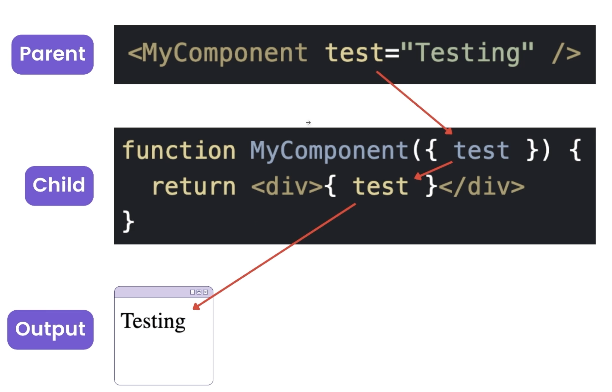
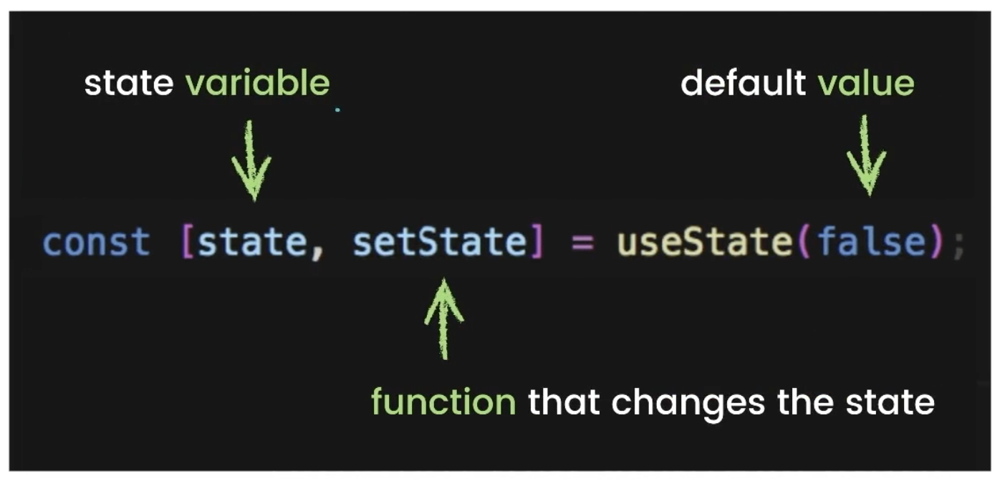

# 📚 My-React-Notes
This is a collection of my React notes. It includes the basics of React, React Hooks, Routing, API Integration and more.

# React Basics
## Index
1. [Introduction](#1-introduction-⭐️)
2. [Reusable Components](#2-reusable-components-⭐️)
3. [Props](#3-props-⭐️)
4. [Events Handlers](#4-events-handling-⭐️)
5. [React Hooks](#5-react-hooks-⭐️)
6. [Routing](#6-routing-⭐️)
## ❗️ Quick notes
### 1. If a function is being called at the beginning.
- Make sure to remove the `React.StrictMode` in the `index.js` file to avoid the function being called twice.
  - `React.StrictMode` is used to check for potential problems in the application.

### React better practices ✨
- `<>`: use fragment to wrap multiple elements incase of returning multiple elements without the need of extra div

### JS Side Notes
#### Operators
- And: `&&`
- Or: `||`
- Not: `!`
- Ternary: `? :`
  - Use to check if a condition is true or false
  - Example: `5 === 5 ? "Yes" : "No"` (If 5 is equal to 5, return Yes, else return No)
  - Example: `isModelOpen ? <Modal /> : null` (If isModelOpen is true, return Modal, else return null)
- Change value to boolean: `!!`
  - Use to turn a number into a boolean value
- Nullish Coalescing: `??`
- Optional Chaining: `?.`
- Logical Assignment: `&&=`, `||=`
- Nullish Assignment: `??=`
- Set value to false: `!!0`

#### Conditional Rendering
```js
{isModalOpen && <Modal />}
// or
{isModalOpen ? <Modal /> : null}
```

### Event Handlers
- When passing an event in a function, if you dont want it to be called immediately, you can pass it as a function.
  - ```<button onClick={Function()}>```
- If you want it to be called when button is being click, remove the parenthesis.
  - ```<button onClick={Function}>```

### File Structure explanation 📝
- `App.js`: is the main file that is rendered in the browser
  - Used to render all the components
- `index.js`: is the file that renders the App.js file
  - Used to render the App.js file in the browser
  - Adding FontAwesome
    - `import '@fortawesome/fontawesome-free/css/all.min.css'`


## 1. Introduction ⭐️
- React is a JavaScript library for building user interfaces.
- Maintain by Facebook

### 🤨 Why React?
  - Easier to use 
- Maintainable
- Reusable
- Most popular front-end framework

### Get Started
1. Command to install create-react-app
```bash
npx create-react-app my-app
```
1. Command to start the server
```bash 
npm start
```

## 2. Reusable Components ⭐️
- Components are the building blocks of a React application
- `Two parts of a component`
  - Create a component
  - Use a component
#### Reason for using jsx
- jsx is a syntax extension for JavaScript
- jsx allow auto completion when writing HTML
### Step 1: Create a component
1. Create a new file
2. Inside of this file create a function
3. Inside of your function return some jsx
4. Export your function
```javascript
// Create Todo.jsx
function Todo(){
    return(
        <div>
        <p>Todo</p>
        </div>
    )
}
// Export the function
export default Todo
```
### Step 2: Use a component
#### 1. Import the component
```jsx 
import Todo from './components/Todo.jsx'
```
- **Note:** The file path is relative to the file you are importing from. For example, this is being imported into the App.js file, so the path is relative to the App.js file.
#### 2. Use the component
- `<Todo />` this is the shortnotation for using a component

## 3. Props ⭐️
- `Props` are arguments passed into React components
- **CONS:** help make components dynamic
- `Two steps to use props`
  - Create the props
  - Use the props
### Props notice
- If pass a string, it should be in quotes
  - `<Todo propName="Prop Value"/>`
- If pass a number, it should not be in quotes
  - `<Todo propName={10}/>`
### Step 1: Create the props
- Pass in the property name and value in parent file
  - `<Todo propName="Prop Value"/>`

### Step 2: Use the props
- Use the props in the component file
  - ```js
    function Todo(props){
        return(
            <div>
            <p>{props.propName}</p>
            </div>
        )
    }

    // Simpler way
    function Todo({propName}){
        return(
            <div>
            <p>{propName}</p>
            </div>
        )
    }
    ```



## 4. Event Handling ⭐️
- `Event Handlers` are functions that are called when an event is triggered. It
- Most important event handlers:
  - `onClick`: is called when an element is clicked
  - `onChange`: is called when the value of an element is changed

### 1. onClick Note
- **1️⃣ Work Right Away** 
  - If you want to pass an argument in a function, you can pass it as a function.
    - `<button onClick={Function()}>`
-  **2️⃣ Work onClick** 
   -  If you want it to be called when button is being click, remove the parenthesis.
     - `<button onClick={Function}>`
   - If it have an argument, add `() => ` then pass the function with the argument
     - `<button onClick={() => Function(argument)}>`
### 2. onChange
```jsx
// On Change Example
import React, {useState} from 'react';
function Input(){
    const [input, setInput] = useState("")
    function handleChange(event){
        setInput(event.target.value) // Get the value of the input
    }
    return(
        <div>
            <input type="text" value={input} onChange={handleChange}/>
            <p>{input}</p>
        </div>
    )
}
```
- `event.target.value`: is used to get the value of the input field
- `event.target.checked`: is used to get the value of a checkbox

## 5. React Hooks ⭐️
- `Hooks` are functions that let you use state and other React features without writing a class
- Most important hooks:
  - `useState`
    - Define: is how we define variables in React.
    - When a variable is changed, it re-renders the page automatically and add in the changes.
  - `useEffect`
    - Define: is how we define side effects in React.
    - Side effects are things that happen outside of the component.

### 1. Call Hooks
- `useState`: is a hook that allows you to have state variables in functional components
  - `import {useState} from 'react'`
### 2. useState
- What is conditional rendering?
  - Rendering a coponent when a certain condition is met. 
#### ⬇️ useState Structure 
- `const [variable, setVariable] = useState(initialValue)`
  - `variable`: is the variable that you want to keep track of
  - `setVariable`: is the function that you use to change the value of the variable
  - `initialValue`: is the default value of the variable that setup when the component is rendered




1. Use a callback to get the previous value
- `setCounter((previous)=> previous +1)`
1. Spread out all the properties of the prev state `...`
- `setCounter((previous)=> ...previous, quantity: previous.quantity + 1)`
1. Only change thee property that you need to change
### 2.1. useState Specific Case 👩🏽‍💻
- **Number:**
  - Pass in the number `setNum(10)`
  - Incase of dependency on previous value, use a callback
    - `setNum((prev)=> prev + 1)`
- **Boolean:**
  - Pass in the boolean `setBool(true)`
  - Incase of dependency on previous value, use a callback
    - `setBool((prev)=> !prev)`
- **Strings:**
  - Pass in the string `setStr("Hello")`
  - Incase of dependency on previous value, use a callback
    - `setStr((prev)=> prev + " World")`
- **Objects:**
  - Pass in the object `setObj({name: "John", age: 20})`
  - Incase of dependency on previous value, use a callback
    - `setObj((prev)=> {...prev, age: prev.age + 1})`
- **Arrays:**
  - Pass in the array `setArr([1,2,3,4])`
  - Incase of dependency on previous value, use a callback
    - `setArr((prev)=> [...prev, 5])`
#### Practice 1
```jsx
const Counter = () =>{
    const [num, count] = useState(0);

    function plus(){
        count((prev) => prev +1)
    }

    function minus(){
        count((prev) => prev -1)
    }
    return(
        <>
        <h1>Counting machine</h1>
        <h2>Count num: {num}</h2>
        <button onClick={() => plus()}>+</button>
        <button onClick={()=>minus()}>-</button>
        </>
    )
}

export default Counter
```
#### Example 2
```jsx
import React, {useState} from 'react';

// const[init, increment] = useState(0)
function Counter(){

    const [cart, setCart] = useState({
        item: "apple",
        quantity: 0,
    })
    function plus(){
        //1. Use a callback to get the previous value
        //2. Spread out all the properties of the prev state
        //3. Only change thee property that you need to change
        setCart(prevCart =>({
            ...prevCart,
            quantity: prevCart.quantity + 1,
        }))
    }
    function minus(){
        setCart(prevCart =>({
            ...prevCart,
            quantity: prevCart.quantity - 1,
        }))
    }
    return(
        <div>
            <h1>Counter Test: {cart.quantity} {cart.item} </h1>
            <button onClick={()=> plus()}>Increment</button>
            <button onClick={()=> minus()}>Decrement</button>
        </div>
    )
}
export default Counter
```

### Emitting Events (UseState specific case)
- `Emitting Events` is a way to notify the parent component that something has happened in the child component. If we want to detect when a button is clicked in the child component, we can use this method.
```jsx
// Parent Component
function Parrent(){
  // Function to be called when button is clicked
  function clicked1(){
    console.log("Parent notified")
  }

  return(
    <div>
      <Child clicked2={clicked1}/>
    </div>
  )
}

// Child Component
function Child({clicked2}){
  returnn(
      <button onClick={clicked2}>Click me</button>
  )
}

```

### 3. useEffect 
- `useEffect` is a hook that fetches data from an API when ever the component is rendered or when a action is performed.

#### 1. useEffect structure
- `useEffect(()=>{}, [])`:
  - If [] is **not present**, it will be called everytime the component is rendered
  - If [] is **present**, it will only be called once when the component is mounted
  - If [] has **a value**, it will be called everytime the value in the array changes

```jsx
import {useState, useEffect} from 'react';
useEffect (() =>{
  console.log("Page rendered everytime")
})

useEffect (() = >{
  console.log("Page rendered once")
}, [])

useEffect (() =>{
  console.log("Page rendered when value changes and when page is rendered")
}, [value])
```

## 6. Routing ⭐
### 1. Install React Router 
- `React Router` is a collection of navigational components that compose declaratively with your application.
```bash
npm install react-router-dom@6.3.0
```
### 2. Import React Router
```jsx
import {BrowserRouter as Router , Routes, Route, Link} from 'react-router-dom';

function App(){
  return(
     <>
     <Router> // Wrap the Routes in the Router
        <Nav /> // Navigation component
        <Routes> // Routes are used to define the routes
          <Route path="/" element={<Home />} /> // Define the path and the component to be rendered
          <Route path="/about" element={<About />} />
        </Routes> 
     </Router>
     </>
  )
}


import {Link} from 'react-router-dom';
function Nav(){
  return(
    <nav>
      <Link to="/">Home</Link>
      <Link to="/about">About</Link>
    </nav>
  )
}
```


- `Router`: is used to wrap the Routes
- `Routes`: is used to define the routes
- `Route`: is used to define the path and the component to be rendered (need to stay inside the Routes)
- `Link`: is used to create a link to the path ( if use in a Nav.jsx file, remember to import link to the file)

### 3. Route Parameters (Dynamic Routing)
- `useParams`: is a hook that allows you to access the unique parameters in the URL
```jsx
import {useParams} from 'react-router-dom';

function Users(){
  const {id} = useParams();
  // Fetch the data from the API using the unique id
  return(
    <div>
      <h1>User: {id}</h1>
    </div>
  )
}
```

## 7. API Integration ⭐
1. Install `Asios`
```bash
npm install axios
```
2. Import `axios`, `useState` and `useEffect`
```jsx
import axios from 'axios';
import {useState, useEffect} from 'react';
```
2. Create Async Function to fetch data from the API
3. Use the `useEffect` hook to call the function
4. Use the `useState` hook to store the data
5. Display the data in the component

```jsx


function Profile(){

}
```
### 1. Axios Introduction
- `Axios` is a promise-based HTTP client for the browser and will be used to fetch data from an API.

1. Install Axios
```bash
npm install axios
```